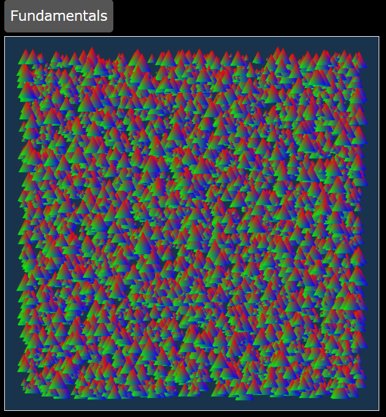
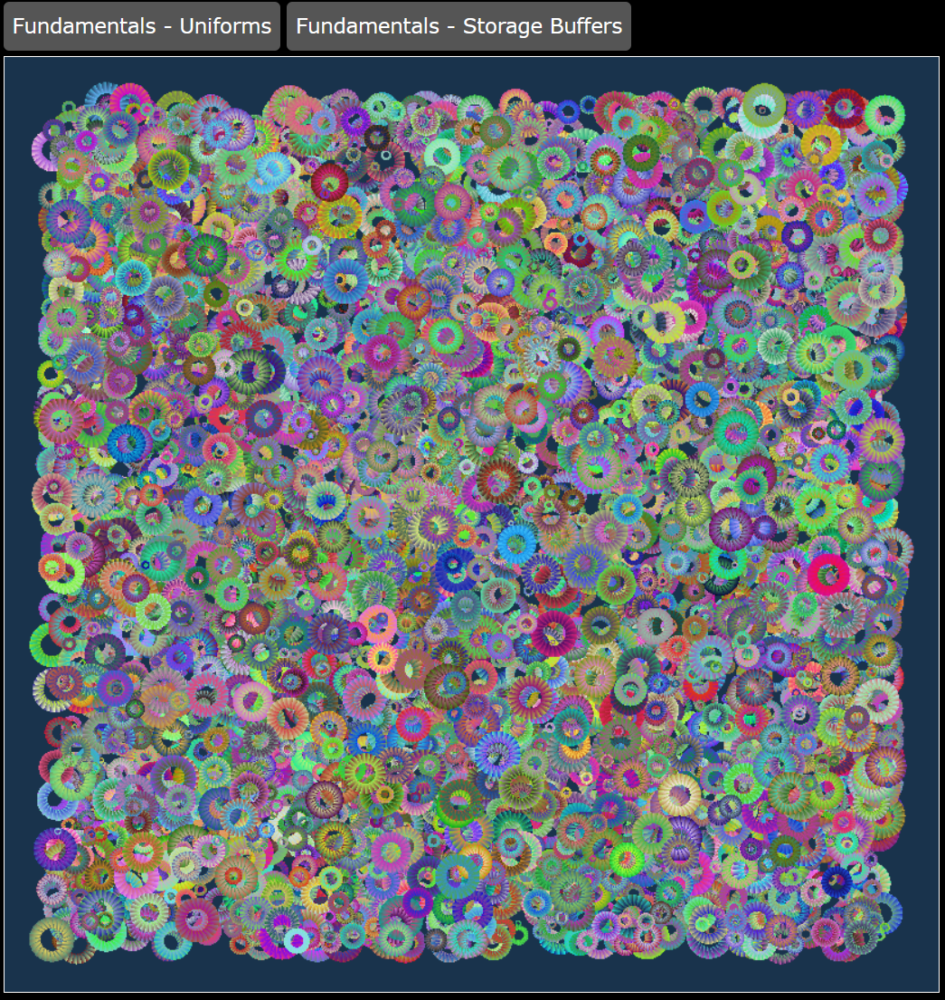

# Following Allong the WebGPU Fundamentals tutorial articles
Original articles: [WebGPU Fundamentals](https://webgpufundamentals.org/)

## Using this repository
This repository is a collection of the code I wrote while following the tutorial articles. Each article has its own folder, and each folder has a `README.md` file that explains what the code does and how to run it.

From the command line, in the project root folder:
```bash
npm install
npm run build
```

In Visual Studio Code, install the [`Live Server`](https://marketplace.visualstudio.com/items?itemName=ritwickdey.LiveServer) extension. Then, open the `index.html` file in the root folder and click the `Go Live` button at the bottom of the window.


>